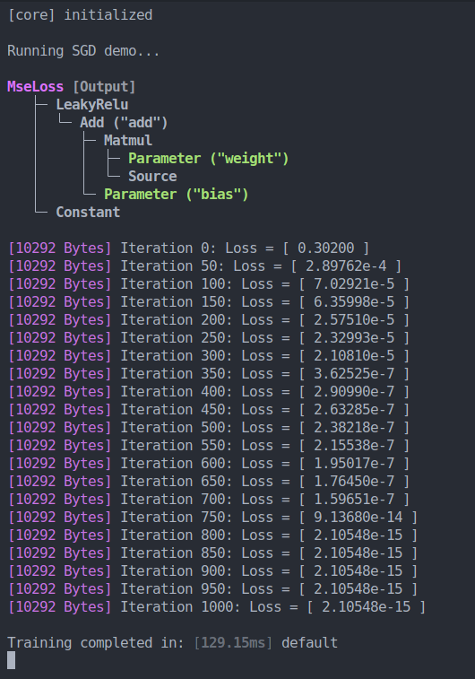

<br>

<p align="center">
  
</p>

## A minimalistic, zero-deps tensor library with a NumPy-like API
Talos is a recreational programming project that helps me understand how machine learning works on the lowest levels. The goal for this project is to build a library that provides the basic array features of NumPy (step 1) and to then graft an autograd system and whatever else is necessary for training a basic model, onto it (step 2). I am quite close to completing step 2 at this point.

For a working SGD demo see **[examples/sgd.ts](examples/sgd.ts)**.

Talos uses C/WebAssembly to accelerate operations on tensors. All tensor data and metadata resides within WASM memory and and is accessed by JS only for validating operation parameters, printing and other things of that nature.

### SGD Demo
```ts
import { RawTensor, core_ready, set_rand_seed, mgmt, optim, tensor, tensor_producer } from "../index";

// if your runtime does not support top-level await,
// you'll have to use core_ready.then(() => { ... }) instead
await core_ready;
set_rand_seed(Date.now());

console.log("\nRunning SGD demo...\n");

const size = 100;
const weight = tensor([2, size], true).kaiming_normal(size * 2).set_name("weight");
const bias = tensor([size], true).kaiming_normal(size).set_name("bias");
const target = tensor([size]).uniform(0, 1);

const a = RawTensor.create([size]);
const input = tensor_producer([size], () => a.normal(3, 1));

// define computation graph: mean((target - relu(Weight * input + Bias))^2)
const nn = weight.matmul(input).add(bias).set_name("add").leaky_relu(.05).mse_loss(target);

// finds an execution sequence for the operations involved in the previously defined graph
const graph = nn.graph;
const optimizer = new optim.sgd(graph, { lr: 20 });

graph.print();
console.time();

for (let iteration = 0; iteration <= 1000; iteration++) {
    graph.zero_grad();
    graph.forward();
    graph.backward();
    optimizer.step();

    if (iteration % 50 === 0) console.log(`\x1b[35m[${mgmt.get_total_allocated()} Bytes]\x1b[0m Iteration ${iteration}: Loss = ${graph.output.value.toString()}`);
}

console.write("\nTraining completed in: ");
console.timeEnd();
```

#### SGD Demo Output
<p align="center">
  
</p>

### A quick overview over some tensor operations
Here is a bit of sample code that demonstrates some of the features.
The full feature list is below.
```js
import { core_ready, tensor } from "../dist";

// if your runtime does not support top-level await,
// you'll have to use core_ready.then(() => { ... }) instead
await core_ready;

// all of these functions create instances of the `Tensor` class.
// the arrays represent the shapes of the tensors.
// see `examples/create_and_init.ts` for more ways to create and initialize tensors
const t1 = tensor([2, 2, 3]);
const t2 = tensor([3, 2]);
const t3 = tensor([3]);

// create a tensor from a nested array
const t4 = tensor_from_array([[1, 2, 3], [4, 5, 6]]);

// populate tensors with random data
t1.uniform();
t2.normal(0, 3);
t3.xavier_normal(6);

// talos supports broadcasting by repeating values along axes
// such that tensors of different rank may still be used together
t1.pow(2);  // scalar op
t1.pow(t1); // pairwise op
t1.pow(t3); // broadcasting op

// some basic ops
t1.add(t3);
t1.sub(t3);
t1.mul(t3);
t1.div(t3);

t1.matmul(t2);
t2.dot(t1);
t3.logistic();

// transpositions of tensors are implemented through views
// such that no additional data needs to be allocated
t2.T.matmul(t2);
t2.matmul(t2.transpose(1, 0)); // you can also use permutations for transposition

// As you use the chaining API, a computation graph is automatically constructed,
// that can later be used for training.
const my_tensor = t1.add(t3).mul(t3).sub(4).T; // this tensor will contain only zeros (uninitialized)

// Talos is lazy, this means no actual computation will be performed
// until you call .realize()
const my_realized_tensor = my_tensor.realize(); // this will contain a result

my_tensor.print();
my_realized_tensor.print();

// To print the computation graph of my_tensor (draws a nice tree)
my_tensor.graph.print(true);
```

<p align="center">
  
</p>

## Features
### Currently, these are the operations that Talos supports:
- Broadcasting and de-broadcasting (summation along axes) on all operations
- Accumulative assignments on all operations (`dest[i] += result[i]`)
- Binary operations
    - Pairwise operations
        - Addition, Subtraction, Multiplication, Division, Exponentiation
    - Matrix multiplication
    - Dot product (mimics behavior of NumPy)
- Unary operations:
  - relu, binstep, logistic, negate, sin, cos, tan, asin, acos, atan, sinh, cosh, tanh, exp, log, log10, log2, invsqrt, sqrt, ceil, floor, abs, reciprocal, free, clone
- Reduce operations
  - Min, Max, Sum, Mean
- Metadata operations
  - transpose (with arbitrary permutation of axes)
  - view creation
  - iteration over specific axes
- Initialization
    - rand, normal, fill, zeros, ones, tensor(shape[], data[]?), tensor_like(other_tensor), tensor_scalar(number?)

### How to build
#### Prerequisites
To build and run this project, you will need to install `emcc` (emscripten), `make` and a js runtime environment. I like to use `bun` but you should be able to get this to work with `nodejs` too.

```bash
# should work identically with node
bun install # install dev dependencies
bun run build # build wasm and ts (output in /dist)
```
